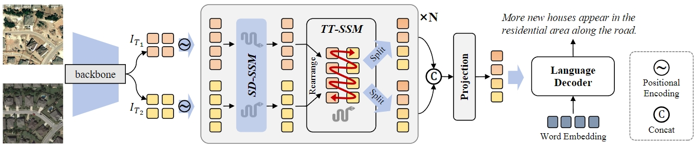
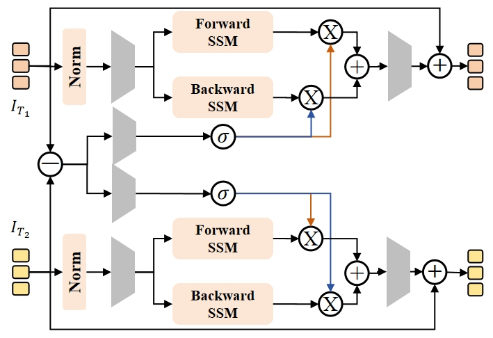
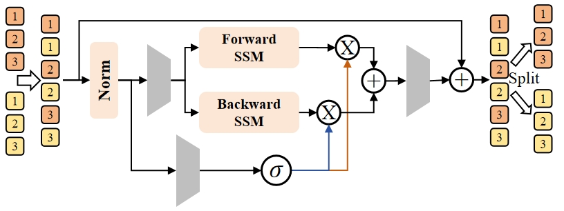
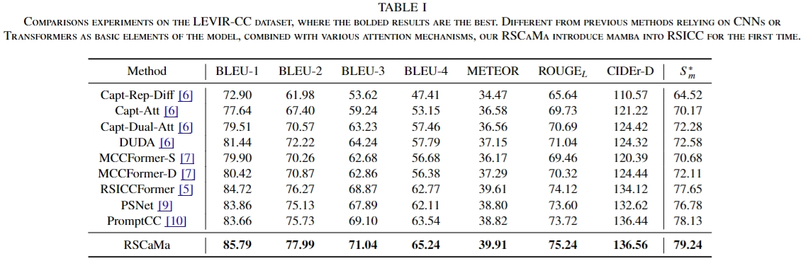
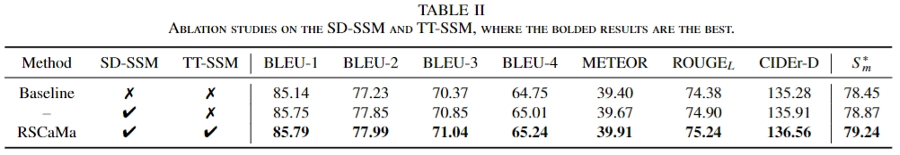
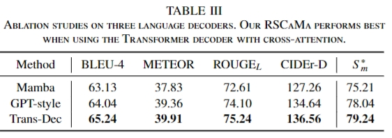
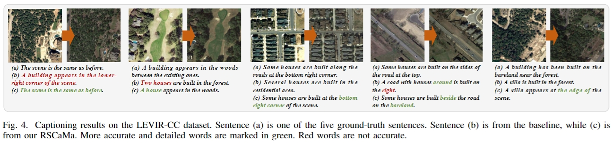

<div align="center">
    <h2>
        RSCaMa: Remote Sensing Image Change Captioning with State Space Model
    </h2>
</div>
<br>
<div align="center">
  
</div>

<div align="center">
  <a href="https://arxiv.org/abs/2404.18895">
    <span style="font-size: 20px; ">ArXiv</span>
  </a>
</div>

[](LICENSE)

**The code will be made public in the next few days.**

## Share us a :star: if you're interested in this repo
## Welcome to our repository! 
This repository contains the PyTorch implementation of "RSCaMa: Remote Sensing Image Change Captioning with State Space Model". 
## Composition of CaMa layers
- **Spatial Difference-guided SSM (SD-SSM)**. To improve the model's perception of changes, we multiply the bi-temporal differencing features and the output of bidirectional SSMs to guide the model.
    <br>
    <div align="center">
      
    </div>
    <br>
- **Temporal Traveling SSM (TT-SSM)**. TT-SSM promotes bitemporal interactions in a token-wise cross-scanning manner.
    <div align="center">
      
    </div>

## Contributions
- We introduce SSM into the RSICC, a multi-modal task, and propose RCaMa for efficient spatial-temporal modelling, providing a benchmark for Mamba-based RSICC.

- We propose the CaMa layer consisting of SD-SSM and TT-SSM. SD-SSM uses differential features to enhance change perception, while TT-SSM promotes bitemporal interactions in a token-wise cross-scanning manner.

- The experiment shows the RSCaMa's SOTA performance and the potential of Mamba in the RSICC task. Besides, we systematically evaluate different language decoding schemes, providing valuable insight for future research.

## Experiment: 
<br>
    <div align="center">
      
    </div>
<be>
<br>
    <div align="center">
      
    </div>
<br>
<br>
    <div align="center">
      
    </div>
<br>
<br>
    <div align="center">
      
    </div>
<br>
    
## Citation: 
```
@misc{liu2024rscama,
      title={RSCaMa: Remote Sensing Image Change Captioning with State Space Model}, 
      author={Chenyang Liu and Keyan Chen and Bowen Chen and Haotian Zhang and Zhengxia Zou and Zhenwei Shi},
      year={2024},
      eprint={2404.18895},
      archivePrefix={arXiv},
      primaryClass={cs.CV}
}
```
